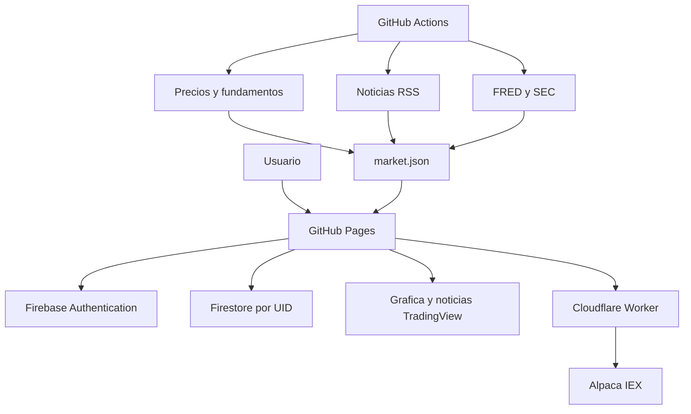

# Investment Research Agent

Aplicacion personal de investigacion bursatil para un horizonte aproximado de
1 mes a 1 ano. Combina analisis tecnico, fundamentos, noticias, entorno macro y
riesgo en un score explicable. No compra ni vende activos y no garantiza
rentabilidad.

## Que incluye

- Inicio de sesion con correo/contrasena y Google mediante Firebase.
- Portafolio, lista de vigilancia, diario de decisiones y pesos personalizados
  sincronizados por usuario en Firestore.
- Panel responsive para laptop y celular.
- Grafica financiera dinamica y noticias recientes por ticker mediante widgets
  gratuitos de TradingView.
- Precio interno reciente mediante Alpaca Basic (feed IEX), consultado una vez
  por minuto mientras la pagina esta abierta.
- Worker de Cloudflare que mantiene las claves de Alpaca fuera de GitHub y del
  navegador.
- Score 0-100 con tecnico 25%, fundamental 30%, noticias 15%, macro 15% y
  riesgo 15%.
- Indicadores SMA 50/200, RSI, MACD, volatilidad y drawdown.
- Fundamentales con SEC EDGAR cuando es posible y datos de mercado como
  respaldo.
- Noticias gratuitas mediante RSS, variables macro de FRED y precios mediante
  `yfinance`.
- Actualizacion automatica en GitHub Actions y despliegue en GitHub Pages.
- Modo demostracion claramente identificado cuando aun no se ejecuta el
  pipeline o no se ha conectado Firebase.

## Arquitectura



GitHub Pages solo sirve archivos estaticos; no puede ejecutar Python ni guardar
secretos. Por eso el recolector profundo corre en GitHub Actions, Cloudflare
protege las claves de Alpaca y Firebase administra identidad y datos privados.

## Precio Alpaca por minuto

La configuracion completa, paso a paso, esta en
`CONFIGURAR_ALPACA_CLOUDFLARE.md`. La forma mas sencilla es desplegar el archivo
`cloudflare-worker/worker.js`, guardar las dos claves como secretos de
Cloudflare y pegar la URL `workers.dev` en **Ajustes > Precio interno · Alpaca**.

El precio reciente se usa en el encabezado del activo, el portafolio y la lista
de vigilancia. Si el Worker o Alpaca no responden, la interfaz conserva el
ultimo precio recibido y puede volver al precio diario de `market.json`. El
score, los fundamentales, las noticias clasificadas y el contexto macro se
recalculan en el workflow diario, no cada minuto.

## Configuracion de Firebase

### 1. Crear o abrir el proyecto

1. En Firebase Console, abre tu proyecto.
2. En **Configuracion del proyecto > Tus apps**, agrega una aplicacion web si
   aun no existe.
3. Conserva el objeto `firebaseConfig` que te entrega Firebase.

### 2. Activar Authentication

1. Ve a **Authentication > Sign-in method**.
2. Habilita **Correo electronico/contrasena**.
3. Habilita **Google** y selecciona el correo de soporte.
4. En **Authentication > Settings > Authorized domains**, agrega
   `TU-USUARIO.github.io` si Firebase no lo agrega automaticamente.

### 3. Crear Firestore y publicar las reglas

1. Ve a **Firestore Database** y crea la base de datos.
2. Abre la pestana **Rules**.
3. Copia todo el contenido de `firestore.rules`, publicalo y no uses reglas
   abiertas de prueba.

Las reglas incluidas permiten que cada cuenta lea y escriba unicamente debajo
de `users/{su_uid}/...`. Ningun usuario puede leer la cartera de otro.

### 4. Variables para desarrollo local

```bash
cp .env.example .env
npm install
npm run build:pages
```

Edita `.env` y reemplaza cada valor con la propiedad equivalente de
`firebaseConfig`:

| Variable | Propiedad de Firebase |
| --- | --- |
| `VITE_FIREBASE_API_KEY` | `apiKey` |
| `VITE_FIREBASE_AUTH_DOMAIN` | `authDomain` |
| `VITE_FIREBASE_PROJECT_ID` | `projectId` |
| `VITE_FIREBASE_STORAGE_BUCKET` | `storageBucket` |
| `VITE_FIREBASE_MESSAGING_SENDER_ID` | `messagingSenderId` |
| `VITE_FIREBASE_APP_ID` | `appId` |

La API key de una aplicacion web Firebase no funciona como una contrasena de
administrador. Aun asi, nunca agregues al repositorio cuentas de servicio,
archivos privados, claves de broker ni tokens con privilegios. La seguridad de
los documentos depende de `firestore.rules`.

## Subir a GitHub y publicar

1. Crea un repositorio nuevo y sube **el contenido de esta carpeta** a la rama
   `main`.
2. En **Settings > Secrets and variables > Actions > Variables**, crea las seis
   variables `VITE_FIREBASE_*` de la tabla anterior.
3. Opcionalmente crea `SEC_USER_AGENT` con un texto descriptivo y un correo de
   contacto, por ejemplo `MiResearchApp contacto@correo.com`.
4. En **Settings > Pages > Build and deployment**, elige **GitHub Actions**.
5. Abre **Actions** y ejecuta manualmente **Actualizar datos de mercado**.
6. Ejecuta **Publicar aplicacion en GitHub Pages** o haz un nuevo `push`.

La actualizacion completa corre todos los dias alrededor de las 5:20 p. m. de
Lima. Asi tambien puede incorporar noticias de fin de semana. Si cambia
`public/data/market.json`, el commit automatico vuelve a publicar la pagina.

La grafica y el bloque de noticias de TradingView se cargan directamente en el
navegador y no necesitan que GitHub vuelva a publicar la aplicacion. Esos
widgets son una capa informativa independiente y no recalculan el score. El
valor del portafolio usa Alpaca cuando esta conectado.

## Personalizar los activos

Edita `data/tickers.json`. Cada registro admite:

```json
{
  "ticker": "UBER",
  "name": "Uber Technologies",
  "sector": "Movilidad",
  "cik": "0001543151"
}
```

El `cik` es opcional y solo se usa para consultar datos publicos de la SEC. No
agregues demasiados simbolos de golpe: los proveedores gratuitos pueden aplicar
limites o bloquear solicitudes repetidas.

## Comandos utiles

```bash
# Construir exactamente lo que se publica en GitHub Pages
npm run build:pages

# Ver la version construida localmente
npm run preview:pages

# Generar datos de mercado en tu laptop
python -m pip install -r requirements.txt
python scripts/collect_market_data.py
python scripts/validate_market_data.py public/data/market.json
```

## Datos guardados en Firestore

```text
users/{uid}/portfolio/{positionId}
users/{uid}/watchlist/{watchItemId}
users/{uid}/journal/{entryId}
users/{uid}/settings/preferences
```

No se guarda tu contrasena en Firestore; Firebase Authentication la administra.
No introduzcas numeros de cuenta, claves de broker o informacion bancaria.

## Interpretacion del score

| Score | Categoria |
| ---: | --- |
| 80-100 | Oportunidad interesante |
| 60-79 | Analizar entrada |
| 40-59 | Mantener vigilancia |
| 0-39 | Evitar |

El score es un filtro de investigacion, no una senal automatica. La interfaz
muestra riesgos, nivel de confianza, desacuerdos del comite y condiciones que
invalidarian la tesis.

## Limitaciones

- `yfinance` y los RSS gratuitos no ofrecen garantias de disponibilidad ni
  datos en tiempo real.
- Alpaca Basic usa IEX; el precio puede diferir del consolidado de todas las
  bolsas estadounidenses.
- La consulta por minuto ocurre mientras la pagina esta abierta. Al regresar a
  una pestana que estaba en segundo plano, la aplicacion consulta de inmediato.
- Los widgets gratuitos de TradingView pueden mostrar cotizaciones retrasadas,
  y su contenido no es consumido por el motor de puntuacion.
- La clasificacion de noticias de esta version usa reglas transparentes por
  palabras; no equivale a FinBERT.
- Los datos fundamentales pueden llegar con retraso o faltar para algunos
  emisores y ETFs.
- No se calculan impuestos, comisiones, liquidez del mercado ni idoneidad
  personal.
- Antes de decidir, revisa la fuente primaria, fecha y moneda de cada dato.

## Licencia

MIT. Consulta `LICENSE`.
